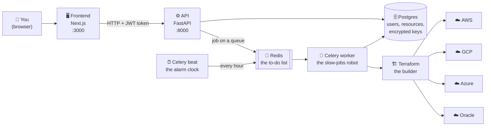
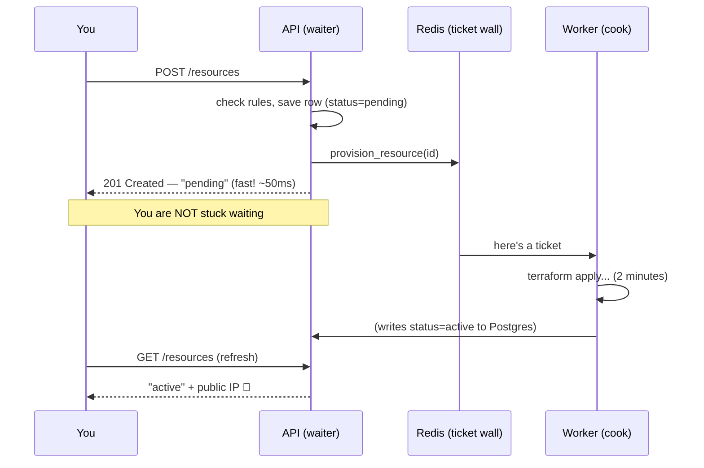
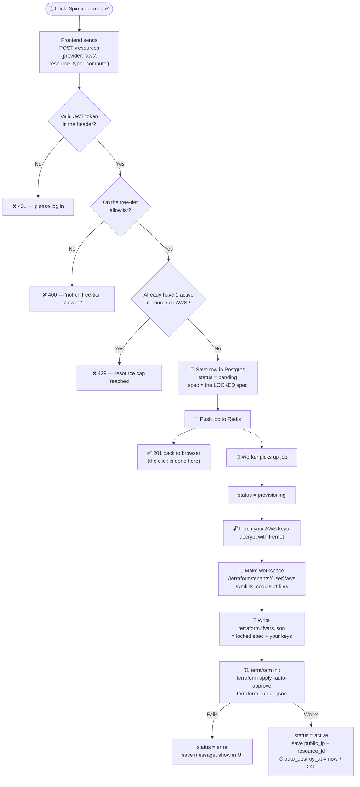
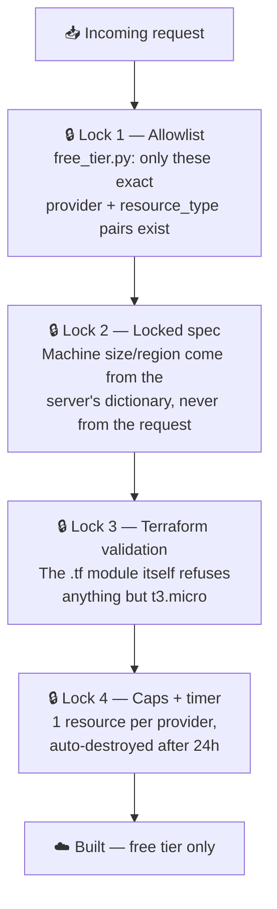
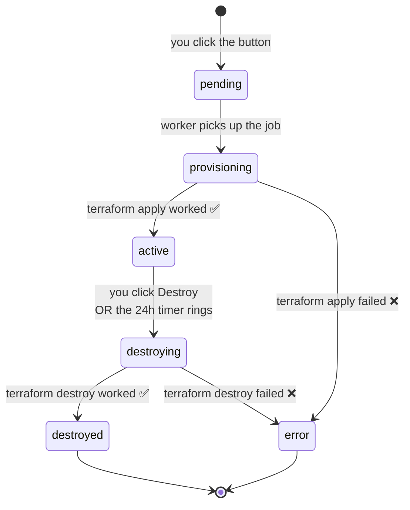
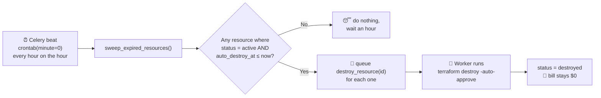
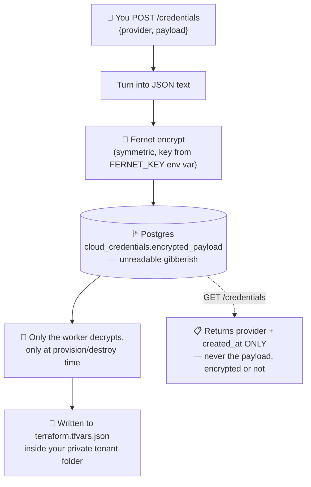
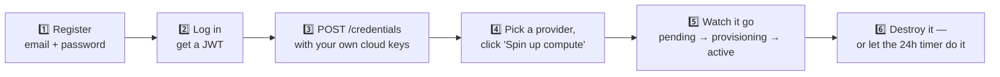

# Multi-Cloud Free-Tier Platform (WIP)

> One dashboard. Four clouds. Real servers. **$0.**

A single web dashboard that creates real computers ("compute instances") on
**AWS, Google Cloud, Azure, or Oracle Cloud** — but *only* the free ones —
using Terraform, then shows them all in one list and cleans them up
automatically after 24 hours.

**This is a technical demonstration of multi-cloud platform engineering, not a
production billing/brokerage product.** See [Known limitations](#known-limitations--what-this-is-not).

---

## Table of contents

1. [Explain it like I'm 10](#explain-it-like-im-10)
2. [The whole thing in one picture](#the-whole-thing-in-one-picture)
3. [What each part does](#what-each-part-does)
4. [The journey of one button click](#the-journey-of-one-button-click)
5. [The safety rules](#the-safety-rules-why-you-cant-get-a-surprise-bill)
6. [A resource's life story](#a-resources-life-story-state-machine)
7. [The self-cleaning robot](#the-self-cleaning-robot-auto-destroy)
8. [Where your secret keys live](#where-your-secret-keys-live)
9. [Running it](#running-it)
10. [API reference](#api-reference)
11. [Repo layout](#repo-layout)
12. [Known limitations](#known-limitations--what-this-is-not)

---

## Explaination

Imagine there are four giant computer stores in the world: **Amazon (AWS)**,
**Google (GCP)**, **Microsoft (Azure)**, and **Oracle**. Each store will rent
you a computer that lives in their warehouse, and you use it over the internet.

Here's the cool part: every one of those stores gives away **one tiny computer
for free**, forever or for a year, as a free sample. The problem is:

- Each store has a totally different website.
- Each one has different rules about which computer is the free one.
- If you pick the *wrong* computer by accident, they charge you money. 💸
- If you forget to turn it off, they keep charging you. 💸💸

This project is a **vending machine with a very strict robot inside it**.

You walk up, pick a store from a dropdown, and press one green button. The robot:

1. **Checks the rules book** — "is this the free computer? yes/no." If no, it
   refuses. It doesn't matter what you typed or what the website sent — the
   robot checks its own book, not yours.
2. **Goes and builds the computer** in that store's warehouse for you.
3. **Puts it on your list**, showing its status and its address (IP).
4. **Sets a 24-hour timer.** When the timer rings, the robot goes back and
   takes the computer apart so you never get a bill.

That's the whole product. One button, four stores, zero dollars, and a robot
that cleans up after you.

**One more important thing:** this app doesn't own any computers. It uses
*your* accounts at those four stores. You hand it your keys, it uses them on
your behalf. Think of it as a valet, not a car rental company.

---

## The whole thing in one picture



Everything above runs in Docker containers defined in `docker-compose.yml`,
except the four clouds on the right — those are the real internet.

---

## What each part does

Think of it as a restaurant:

| Part | Restaurant job | Real job | Where |
|---|---|---|---|
| **Frontend** | The menu and the table | Next.js pages: login, dashboard, buttons | `frontend/` |
| **API** | The waiter | Takes orders, checks the rules, writes them down | `api/app/routers/` |
| **Postgres** | The order book | Stores users, resources, encrypted keys | `docker-compose.yml` |
| **Redis** | The order spike on the kitchen wall | Queue of jobs waiting to be done | `docker-compose.yml` |
| **Celery worker** | The cook | Runs Terraform, which takes minutes | `api/app/services/tasks.py` |
| **Celery beat** | The kitchen timer | Fires the hourly cleanup job | `api/app/core/beat_schedule.py` |
| **Terraform** | The oven | Actually builds things in the cloud | `terraform/modules/` |

### Why is there a cook *and* a waiter?

Because building a cloud server takes **1–3 minutes**. If the waiter stood at
your table waiting for the oven, nobody else could order anything, and your
browser would just spin.

So the waiter (API) writes the order on a ticket, sticks it on the wall
(Redis), and immediately comes back and says *"got it — status: pending."*
The cook (Celery worker) grabs the ticket whenever it's free and does the slow
part in the background. Your dashboard just shows the status changing.



---

## The journey of one button click

You press **"Spin up compute"** with `aws` selected. Here is every single step.



The key detail: **the browser never decides what gets built.** It only sends
`provider` and `resource_type` — two labels. The API looks up the *actual*
machine size, region, and image in `api/app/core/free_tier.py` and writes
*that* into Terraform. Even a hacked frontend can't ask for a $5,000/month GPU
server, because there is no field in which to ask for one.

---

## The safety rules (why you can't get a surprise bill)

There are **four independent locks**. An attacker would have to pick all four.



### What's actually allowed

| Provider | Instance | Region constraint | Free window |
|---|---|---|---|
| AWS | `t3.micro` | `us-east-1` | 750 hrs/mo, first 12 months |
| GCP | `e2-micro` | `us-west1` (also us-central1 / us-east1) | Always free |
| Azure | `Standard_B1s` | `eastus` | 750 hrs/mo, first 12 months |
| Oracle | `VM.Standard.E2.1.Micro` | `us-ashburn-1` | Always free, 2 instances max |

Source of truth: `api/app/core/free_tier.py`. Change it there and everything
else follows — the dashboard dropdown reads it via `GET /resources/catalog`.

**Belt and suspenders:** the AWS Terraform module *also* refuses to build
anything else, even if you ran it by hand:

```hcl
variable "instance_type" {
  type    = string
  default = "t3.micro"
  validation {
    condition     = var.instance_type == "t3.micro"
    error_message = "Only t3.micro is permitted (free tier)."
  }
}
```

**Caps:** `MAX_RESOURCES_PER_PROVIDER = 1` and `AUTO_DESTROY_HOURS = 24`
(`api/app/core/config.py`).

---

## A resource's life story (state machine)

Every resource row in the database is always in exactly one of six states.



The dashboard colour-codes these: green `active`, amber `provisioning`, red
`error`, grey everything else.

---

## The self-cleaning robot (auto-destroy)

This is the part that makes the whole thing safe to leave running.



`auto_destroy_at` is stamped at the moment provisioning succeeds:
`datetime.utcnow() + timedelta(hours=settings.auto_destroy_hours)`.

Because the sweep runs hourly, a resource lives for **24 to 25 hours** — not
exactly 24. That's fine: it's well inside every provider's monthly free
allowance.

---

## Where your secret keys live

Your cloud keys are like the keys to your house. This app needs them to build
things *in your name*, so here's exactly what happens to them.



Also true:

- Passwords are **bcrypt** hashed (`passlib`), never stored in plain text.
- Login returns a **JWT** (HS256, 24h expiry) that the frontend keeps in
  `localStorage` and sends as `Authorization: Bearer <token>`.
- Nothing secret is committed to the repo — you supply `api/.env` yourself.

See [Known limitations](#known-limitations--what-this-is-not) for why one
shared Fernet key is fine for a demo and not for production.

---

## Tenant isolation (nobody touches anybody else's stuff)

Terraform remembers what it built in a *state file*. If two users shared one
state file, one person's "destroy" could delete another person's server. So
every user gets their own folder:

```
/terraform/
├── modules/                       ← the blueprints (shared, read-only)
│   ├── aws/main.tf
│   └── gcp/main.tf
└── tenants/                       ← one private sandbox per user+provider
    ├── 1f2e.../aws/
    │   ├── main.tf                ← symlink to modules/aws/main.tf
    │   ├── terraform.tfvars.json  ← your locked spec + your keys
    │   └── terraform.tfstate      ← what YOU built
    └── 9a8b.../gcp/
        └── ...
```

The `.tf` files are **symlinked**, not copied — one blueprint, many sandboxes,
so fixing the module fixes it for everyone at once
(`_ensure_main_tf_symlink()` in `api/app/services/terraform_runner.py`).

Every database query is also scoped by `user_id`, so you can never see or
delete another user's resource rows — you'd just get a `404`.

---

## Running it

You need: Docker, Docker Compose, and your own AWS and/or GCP account with
free tier still available.

**1. Create the config file and generate a Fernet key**

```bash
cp api/.env.example api/.env
python3 -c "from cryptography.fernet import Fernet; print(Fernet.generate_key().decode())"
```

Paste that key into `api/.env` as `FERNET_KEY`, and set a `JWT_SECRET` to any
long random string.

**2. Start everything**

```bash
docker compose up --build
```

This starts six containers: `postgres`, `redis`, `api`, `worker`, `beat`, and
your frontend dev server.

**3. Open it**

- Dashboard: <http://localhost:3000>
- Interactive API docs (Swagger): <http://localhost:8000/docs>
- Health check: <http://localhost:8000/health>

**4. Use it**



Example of step 3 for AWS:

```bash
curl -X POST http://localhost:8000/credentials \
  -H "Authorization: Bearer $TOKEN" \
  -H "Content-Type: application/json" \
  -d '{"provider":"aws","payload":{
        "aws_access_key_id":"AKIA...",
        "aws_secret_access_key":"..."}}'
```

⚠️ **This provisions real resources on your real cloud accounts.** They're
free-tier eligible, but they're real. The app does not host any compute
itself.

---

## API reference

| Method | Path | Auth | What it does |
|---|---|---|---|
| `POST` | `/auth/register` | — | Create an account |
| `POST` | `/auth/login` | — | Exchange email+password for a JWT |
| `POST` | `/credentials` | JWT | Store (encrypted) cloud keys for one provider |
| `GET` | `/credentials` | JWT | List which providers you've configured (no secrets) |
| `GET` | `/resources/catalog` | — | The free-tier allowlist — drives the dropdown |
| `GET` | `/resources/catalog/estimate` | — | Theoretical $/hr and $/mo per option |
| `POST` | `/resources` | JWT | Provision — validates, caps, queues the job |
| `GET` | `/resources` | JWT | Your resources, newest first |
| `GET` | `/resources/{id}` | JWT | One resource (404 if not yours) |
| `DELETE` | `/resources/{id}` | JWT | Queue a teardown → `202 destroy_queued` |
| `GET` | `/health` | — | `{"status": "ok"}` |

---

## Repo layout

```
api/
  app/
    main.py                    FastAPI app, CORS, router wiring
    core/
      free_tier.py             ⭐ the rules book — single source of truth
      config.py                env-var settings (caps, timers, paths)
      security.py              bcrypt, JWT, Fernet encrypt/decrypt
      db.py, deps.py           SQLAlchemy session, current-user dependency
      celery_app.py            Celery wiring
      beat_schedule.py         the hourly sweep schedule
    routers/
      auth.py                  register / login
      credentials.py           store + list cloud keys
      resources.py             catalog, provision, list, destroy
    services/
      tasks.py                 the three background jobs
      terraform_runner.py      subprocess wrapper around terraform
      pricing.py               hardcoded pricing snapshot
    models/
      models.py                User, CloudCredential, Resource, UsageLog
      schemas.py               Pydantic request/response shapes
  alembic/                     migrations
terraform/
  modules/                     one module per provider (aws, gcp done;
                               azure, oracle are stubs)
  tenants/                     per-user state, created at runtime
frontend/
  app/page.js, login/, dashboard/    Next.js pages
  lib/api.js                   fetch wrapper that attaches the JWT
docker-compose.yml             postgres, redis, api, worker, beat
```

---

## Known limitations / what this is not

- **Not a real multi-cloud reseller.** Actually brokering paid usage across
  providers requires MSP/CSP partner agreements with each cloud (AWS, Azure,
  GCP, OCI), margin/billing infrastructure, and compliance review. This repo
  demonstrates the provisioning/orchestration layer only, using each user's
  own free-tier credentials.
- **Terraform state has no locking configured.** Each tenant/provider pair
  runs in its own directory so concurrent-apply risk is low for this demo, but
  a real deployment should use S3+DynamoDB or GCS native locking instead of
  local state files.
- **Cost dashboard is illustrative.** Hardcoded pricing snapshot
  (`services/pricing.py`), not a live pricing API call — real spend is $0 on
  free tier regardless.
- **Azure/Oracle modules are stubs** — same pattern as AWS/GCP, not yet
  implemented in this scaffold. They appear in the catalog and will fail at
  the Terraform step.
- **Credential storage** uses Fernet symmetric encryption with a single key in
  an env var — fine for a demo, not how you'd do tenant secret isolation in
  production (you'd want per-tenant KMS keys or a real secrets manager).
- **The demo security group opens SSH (port 22) to `0.0.0.0/0`.** Convenient
  for a portfolio demo, wrong for anything real — restrict the CIDR.
- **No polling/websockets in the UI.** The dashboard refreshes on action, not
  on a timer, so you may need to reload to see `provisioning → active`.
